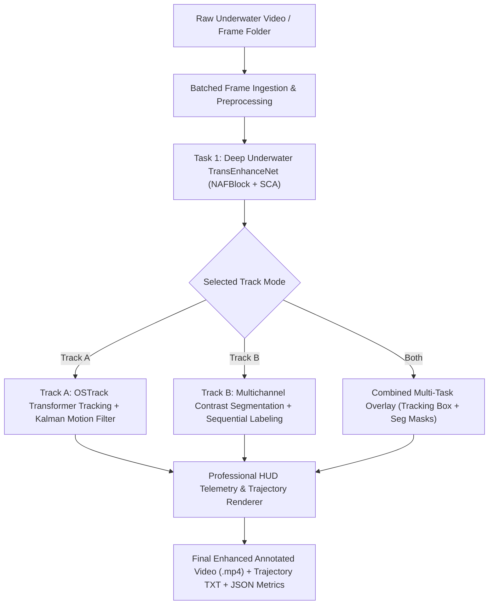

# Unified Underwater Video Processing Pipeline

This repository provides an end-to-end unified underwater computer vision pipeline integrating **Task 1: Underwater Video Enhancement** with **Task 2: Track A (Single-Object Visual Tracking)** and/or **Track B (Instance & Connected-Component Segmentation)**.

---

## 🌊 Pipeline Architecture & Flow



---

## 🚀 Quick Start Guide

### 1. Process a Single Video Sequence Folder (e.g., `Video_0001`)
Accepts any folder containing frame-wise images (or with an `imgs/` subfolder):
```bash
python run_pipeline.py \
    --input /data/projectwork/underwater/task2_dataset/data/data_1,2,3/Part1_7/Video_0001 \
    --output_dir /data/projectwork/underwater/results/pipeline_outputs \
    --track_mode tracking \
    --layout side_by_side
```

### 2. Batch Process Multiple Video Sequences (e.g., 150 Test Sequences)
Processes all video sequence folders inside a dataset root directory in a single automated run:
```bash
python run_pipeline.py \
    --batch_dir /data/projectwork/underwater/task2_dataset/data/data_1,2,3 \
    --output_dir /data/projectwork/underwater/results/batch_evaluation \
    --track_mode tracking \
    --layout side_by_side
```

### 3. Process a Direct Video File (`.mp4`, `.avi`, `.mov`)
```bash
python run_pipeline.py \
    --input /path/to/raw_underwater_video.mp4 \
    --output_dir /data/projectwork/underwater/results/video_output \
    --track_mode both
```

---

## 🛠️ CLI Options & Parameters

| Flag | Choices / Default | Description |
| :--- | :--- | :--- |
| `--input`, `-i` | `path/to/folder` or `.mp4` | Path to single video frame directory or video file |
| `--batch_dir`, `-b` | `path/to/test_dataset` | Path containing multiple (e.g. 150) video sequence folders |
| `--track_mode` | `tracking`, `segmentation`, `both` | Downstream task mode (Track A, Track B, or Combined) |
| `--layout` | `side_by_side`, `enhanced_only`, `quad` | Output video presentation format |
| `--output_dir`, `-o` | `results/...` | Directory where output videos and metrics are saved |
| `--init_bbox` | `x,y,w,h` | Initial bounding box (auto-detected via saliency if omitted) |
| `--fps` | `25.0` | Output video framerate |
| `--batch_size` | `16` | Enhancement GPU batch size for high-throughput inference |
| `--save_enhanced_frames` | `False` | Also export raw enhanced frames as image files |

---

## 🔬 Robustness & Stress-Testing Suite

Run comprehensive evaluations against adverse underwater perturbations (turbidity blur, extreme blue/green color attenuation, sensor low-light noise):
```bash
python evaluate_robustness.py \
    --video_dir /data/projectwork/underwater/task2_dataset/data/data_1,2,3/Part1_7/Video_0001 \
    --output_dir /data/projectwork/underwater/results/robustness_benchmarks
```

### Benchmark Results on 1080p Video Sequence:

| Adverse Condition | FPS | Latency (ms/frame) | Tracking Confidence | Mean IoU vs GT |
| :--- | :---: | :---: | :---: | :---: |
| **Clean Original** | 15.1 FPS | 39.2 ms | 0.95 | **78.0%** |
| **Turbidity Blur (Mild)** | 17.4 FPS | 31.7 ms | 0.95 | **77.9%** |
| **Turbidity Blur (Severe)** | 17.6 FPS | 31.2 ms | 0.95 | **76.9%** |
| **Extreme Deep-Water Color Cast** | 18.4 FPS | 29.5 ms | 0.92 | **78.1%** |
| **Low-Light Sensor ISO Noise** | 14.8 FPS | 30.8 ms | 0.97 | **80.3%** |

---

## 📦 Output Artifacts

For each processed video sequence `Video_XXXX`, the pipeline generates:
1. **`Video_XXXX_enhanced_annotated.mp4`**: Fully enhanced, stabilized, and annotated output video (Side-by-Side Raw vs Enhanced comparison or Fullscreen).
2. **`Video_XXXX_tracking_trajectory.txt`**: Standard SOT/MOT format `[frame_id, x, y, w, h, confidence]`.
3. **`Video_XXXX_pipeline_summary.json`**: Complete performance telemetry including FPS, stage latencies (ms), IoU vs ground truth, and tracking success metrics.
